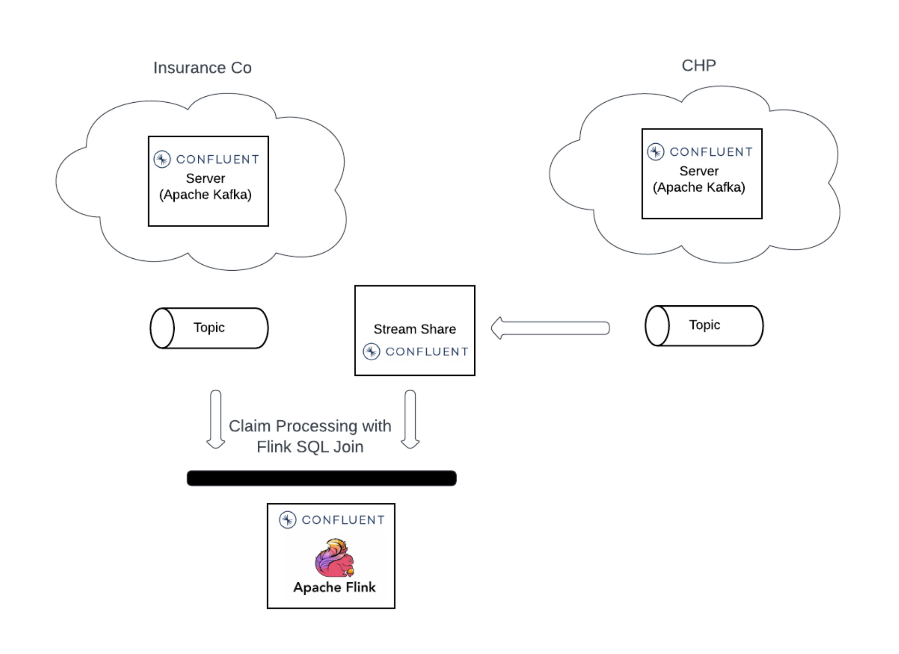
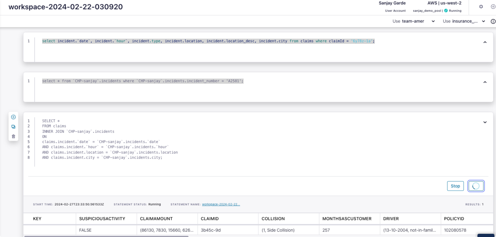

# flink-cc-demo

A simple demo for cross-cluster joins between two Kafka clusters using Flink on Confluent Cloud. This cross-cluster join is not possible with ksqlDB.

## The Use Case: 
An Insurance company can validate the authenticity of the submitted claims in real-time by cross-referencing (SQL join) it with traffic incidents (weather, road repairs, collisons etc) published by an organization like California Highway Patrol(CHP) as here: https://cad.chp.ca.gov/traffic.aspx?ddlComCenter=BFCC . 

This data can be published to a Apache Kafka topic 'incidents' hosted by an organization like CHP. This data can be joined with another topic 'claims' hosted by an insurance company that captures claims submitted with FlinkSQL joins to validate the authenticity of the claims in real-time .

Of course you will need to use another Confluent Cloud feature, the Stream Shares, https://docs.confluent.io/cloud/current/stream-sharing/index.html to expose topics across organizations. The scope of this demo does not include Stream Shares. Note that Flink only work with clusters in the same region.

## Steps: 
* Cluster setup using Terraform:  Set up the two clusters (CHP & InsuranceCo) in the Confluent cloud using [main.tf](./terraform/main.tf) file in the terraform folder. Make sure that you add the tfvars file for the values of the variables defined in the [variable.tf](./terraform/variables.tf) file. (Note: The main.tf assumes you are importing a Confluent Cloud environment and schema registry, if not you can always create a new environment and a schem registry as shown in the Confluent Terraform examples [here.](https://github.com/confluentinc/terraform-provider-confluent/tree/master/examples))
* Publish incidents: publish incidents to the CHP cluster using [publish_incidents.sh](./publish_incidents.sh)
* Publish claims:  publish claims to the InsuranceCo cluster using [publish_claims.sh](./publish_claims.sh)
* Create Flink compute pool:  At this time create your Flink compute pool as described [here.](https://docs.confluent.io/cloud/current/flink/get-started/quick-start-cloud-console.html). No script is provided for this as it is expected that you will navigate to the Confluent Cloud page and talk through the process like what is a Flink compute pool, What is a Flink SQL workspace, CFU etc. Although the Confluent terraform provider supports Flink and you can automate creation of Flink resources if needed.
* Run SQL statement with the join: In your SQL workspace type the query below and hit the run button.

`SELECT * FROM claims
  INNER JOIN CHP_Sanjay.incidents
  ON 
    claims.incident.`date` = CHP_Sanjay.incidents.`date` 
  AND 
    claims.incident.`hour` = CHP_Sanjay.incidents.`hour` 
  AND 
    claims.incident.location = CHP_Sanjay.incidents.location
  AND 
    claims.incident.city = CHP_Sanjay.incidents.city;`

  Nothing will happen as we haven't published joinable data yet.
  * Publish joinable incident:  Publish joinable incident with [publish_joinable_incident.sh](./publish_joinable_incident.sh)
  * Publish joinable claim:  Publish joinable claim with [publish_joinable_claim.sh](./publish_joinable_claim.sh)
  * A single record should show up:  
  

